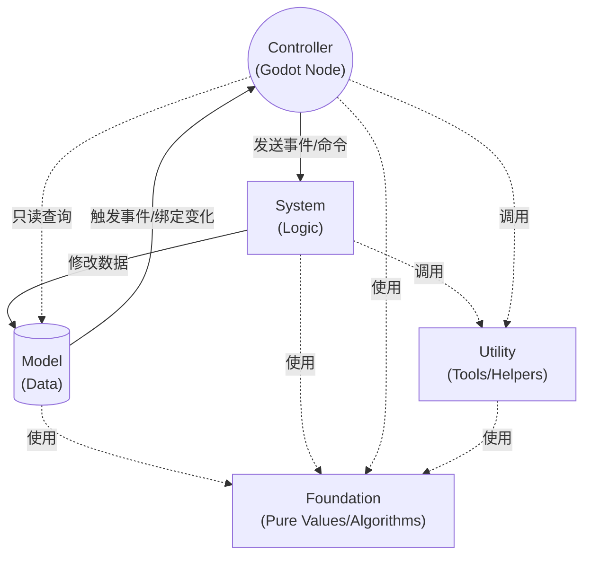

# 01. 架构概览 (Architecture)

GF Framework 的核心基于控制反转 (IoC) 的思想，通过统一的调度器管理所有组件。整体可以拆成五层：**Foundation（基础层）**、**Model（数据模型）**、**System（系统逻辑）**、**Controller（控制器/表现）** 和 **Utility（工具）**。其中 `Foundation` 不进入 `GFArchitecture` 容器，其余四层由运行时统一调度。

## 核心单例与体系结构

整个框架的入口是全局 AutoLoad 节点 —— **`Gf`**。它唯一的作用是挂载在 Godot 的全局根节点下，驱动 `_process` 与 `_physics_process`。

在 `Gf` 背后，真正承载所有业务的对象是 **`GFArchitecture`**。它是一个纯代码容器，负责管理所有 `Model`、`System`、`Utility` 的注册、生命周期调用以及事件总线的派发。`Foundation` 层则作为容器外的纯基础件，被这些运行时模块直接依赖。

```text
Godot SceneTree
 └── Root
	  └── Gf (AutoLoad) -> [GFArchitecture 容器]
							  ├── Models     (GFModel)
							  ├── Systems    (GFSystem)
							  ├── Utilities  (GFUtility)
							  └── EventBus   (TypeEventSystem)

Pure Foundation Layer
 ├── Numeric    (GFBigNumber / GFFixedDecimal)
 ├── Formatting (GFNumberFormatter)
 └── Math       (GFProgressionMath)
```

## 五层分工

### 1. Foundation (基础层) - `addons/gf/foundation/*`
- **职责**：承载纯值对象、纯算法、纯格式化工具。
- **例子**：`GFBigNumber`、`GFFixedDecimal`、`GFNumberFormatter`、`GFProgressionMath`。
- **规则**：
  - 不注册到 `Gf` / `GFArchitecture`。
  - 不依赖 SceneTree、Node 生命周期或框架事件总线。
  - 可以被 `Model`、`System`、`Controller`、`Utility` 直接引用。
  - 优先放"机制原语"，而不是具体项目里的业务规则。

### 2. Model (数据层) - `GFModel`
- **职责**：只负责存储游戏的核心数据状态（如玩家金币、角色属性、背包数据等）。
- **规则**：
  - 不能包含复杂的业务运算逻辑。
  - 不能直接引用或操作 `System` 或 `Controller`。
  - 提供序列化 (`to_dict`) 与反序列化 (`from_dict`) 接口以支持存档。

### 3. System (逻辑层) - `GFSystem`
- **职责**：纯代码业务逻辑运算中心。
- **规则**：
  - 继承自 `GFSystem`，不继承自 Node，脱离场景树管理。
  - 这里负责监听事件、修改 Model 的数据、派发状态变更事件。
  - 拥有 `tick()` 和 `physics_tick()` 生命周期用于定频运算。
  - **绝不**直接引用 `Controller`（表现层节点）。

### 4. Controller (表现层/控制器) - `GFController`
- **职责**：连接代码逻辑与 Godot 场景树视图（UI节点、3D实体节点等）。
- **规则**：
  - 继承自 `GFController` (其本身是 Node)。
  - 负责接收玩家输入或 Godot 引擎的回调。
  - 从 `Model` 查询数据来更新自身视图。
  - 监听 `System` 发出的事件或 `BindableProperty` 的通知来执行动画、特效或UI刷新。
  - 不能包含核心业务数据运算，保持本层足够"轻量"和"可随时销毁"。

### 5. Utility (工具层) - `GFUtility`
- **职责**：提供与游戏核心业务逻辑无关的底层支撑。
- **例子**：时间缩放管理、存档读写、对象池、异步资源加载等。
- **规则**：
  - 持有运行时状态，或需要被容器统一初始化、更新、销毁。
  - 可被框架内任何其他层直接调用。

---

## 信息流转图示

在 GF Framework 中，数据的流动具有严格的方向限制，以保证模块间的低耦合：



## IDE 智能语法提示机制

GF Framework 特意设计为不需要向任何基类中注入具体的类型，所有的组件获取统一通过特定的全局宏（`Gf.get_system(...)` 等）获取。

结合 Godot 4 的静态类型特性，**强烈建议**在获取任何对象后立即使用 `as` 进行类型断言，这能激活完美的 IDE 代码补全：

```gdscript
# 在 Controller 中获取数据并更新UI
var player_model := Gf.get_model(PlayerModel) as PlayerModel
health_label.text = str(player_model.current_health)

# 触发业务逻辑
var battle_system := Gf.get_system(BattleSystem) as BattleSystem
battle_system.start_encounter()
```

## `GFArchitecture` 全局状态快照

在重构版本 1.3.0 中，`GFArchitecture` 引入了非常强大的全局状态快照功能：

```gdscript
# 获取全局快照，它会自动搜集所有已注册的 GFModel 的状态（调用它们各自的 to_dict 方法）
# 如果已经注册了 GFCommandHistoryUtility，它的撤销重做堆栈也会一并被打包！
var global_snapshot: Dictionary = Gf.architecture.get_global_snapshot()

# 还原快照，非常适合用于读取存档
Gf.architecture.restore_global_snapshot(global_snapshot, func(data):
	# 这里用于把存放进来的指令字典反向序列化成自定义的具体 Command 实例
	pass
)
```

有了这个功能，持久化存档操作可以被浓缩到一行代码解决，甚至完美还原了玩家游玩的各个悔步动作栈。
