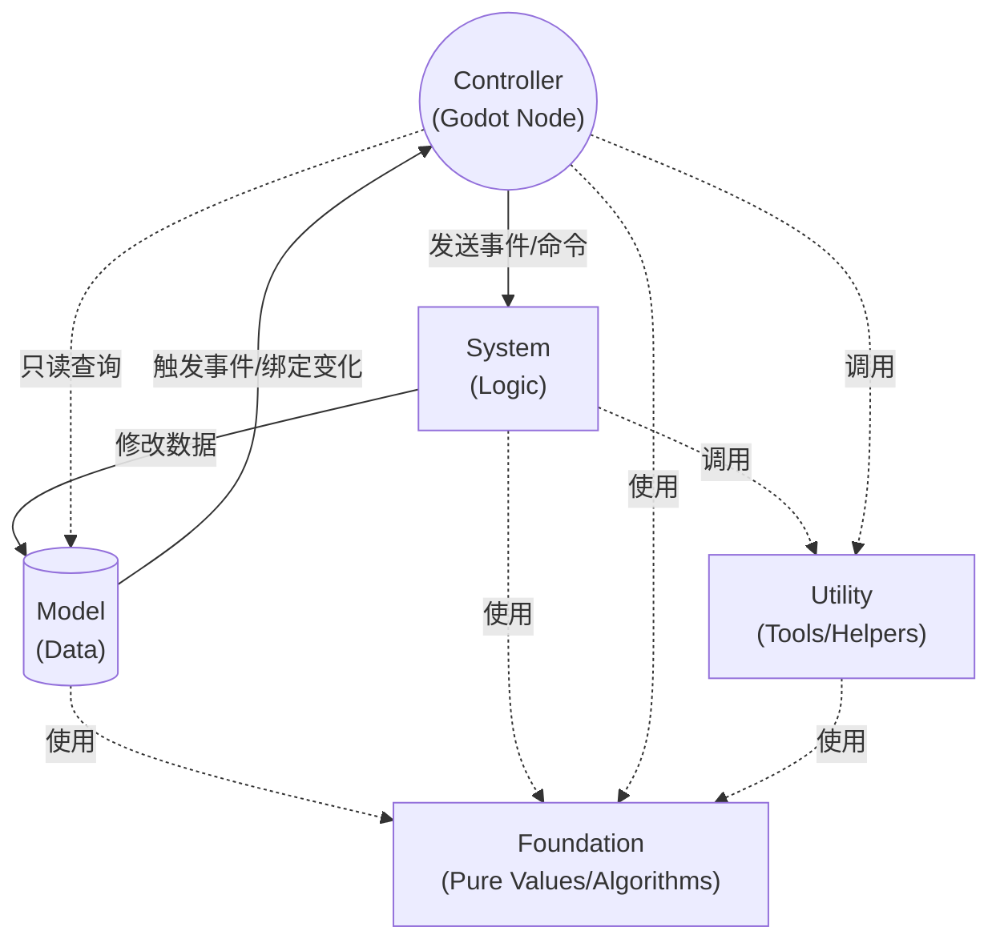

# 信息流方向

GF 推荐让数据和调用保持单向、显式和可诊断。Controller 负责连接 Godot 场景树，System 负责业务流程，Model 保存状态，Utility 提供运行时服务，Foundation 提供纯算法和纯数据结构。

## 推荐方向

- Controller 可以发送事件或命令给 System，也可以只读查询 Model。
- System 可以修改 Model，并通过事件或绑定状态通知 Controller。
- Model 不主动调用 Controller 或 System。
- Utility 提供通用服务，不解释项目业务。
- Foundation 可以被所有层直接使用。

## 避免的方向

- System 直接引用场景节点或 Controller。
- Model 保存 UI、动画节点、临时场景对象或输入状态。
- Foundation 依赖架构容器、事件总线或 SceneTree。
- Utility 为具体玩法写死规则。

这些限制能让核心逻辑脱离场景树测试，也能让 UI、关卡节点和表现层在场景切换时安全销毁。
