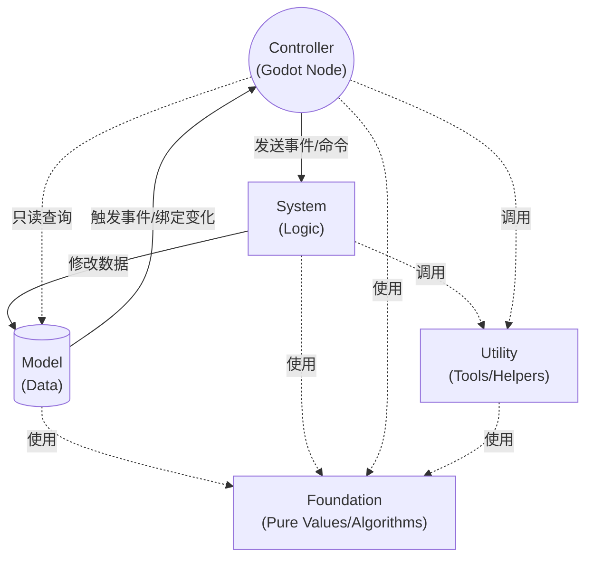

# Kernel 架构容器

本页聚焦 GF 的核心容器与分层边界：`Gf`、`GFArchitecture`、Model/System/Utility/Controller 的职责，以及全局和局部架构如何协作。

GF Framework 的核心基于控制反转 (IoC) 的思想，通过统一的调度器管理核心运行时模块。整体可以拆成五层：**Foundation（基础层）**、**Model（数据模型）**、**System（系统逻辑）**、**Controller（控制器/表现）** 和 **Utility（工具）**。其中 `Foundation` 不进入 `GFArchitecture` 容器；`Model`、`System`、`Utility` 由运行时统一注册、初始化和调度；`Controller` 仍由 Godot 场景树管理，并通过 `GFController` 接入当前架构。

## 核心单例与体系结构

整个框架的入口是全局 AutoLoad 节点 —— **`Gf`**。它挂载在 Godot 的全局根节点下，负责持有当前 `GFArchitecture`、执行项目级 Installer、代理常用注册/查询接口，并把 `_process` 与 `_physics_process` 转发给架构。

在 `Gf` 背后，真正承载所有业务的对象是 **`GFArchitecture`**。它是一个纯代码容器，负责管理所有 `Model`、`System`、`Utility` 的注册、生命周期调用以及事件总线的派发。`Foundation` 层则作为容器外的纯基础件，被这些运行时模块直接依赖。

## 层级依赖边界

GF 的源码层级必须保持单向依赖：

```text
addons/gf/kernel   <-  addons/gf/standard   <-  addons/gf/extensions
```

`kernel` 是最底层，只能放框架启动、注册、注入、生命周期、事件、绑定、扩展机制、编辑器扩展点和内核协议。`standard` 可以依赖 `kernel`，但 `kernel` 不能 `preload()`、`load()` 或直接引用 `standard` 的脚本路径和具体类名。`extensions` 是可选能力，必须通过 manifest、协议或用户显式装配接入；`kernel` 和 `standard` 都不能硬绑定、动态探测或弱联动某个 GF 内置扩展。

判断一个能力是否该进入 `kernel` 时，用一条规则：**如果 `kernel` 运行时必须直接知道它，它就是内核契约或内核基础设施。** 例如 `GFScriptTypeInspector` 被容器注册校验、事件可赋值派发、绑定和编辑器类型索引共同使用，因此属于 `addons/gf/kernel/core`；时间缩放则由 `GFTimeProvider` 定义为内核协议，标准库的 `GFTimeUtility` 只是一个实现。

根插件 `addons/gf/plugin.gd` 是组合入口，可以同时知道 `kernel` 与 `standard`，负责把标准库声明的编辑器增强记录传给 `kernel/editor` 辅助脚本。这个例外不改变内核边界：`addons/gf/kernel/**` 本身仍不能依赖 `addons/gf/standard/**`。

框架内部通过 `GFAutoload` 解析全局 AutoLoad 节点，避免插件首次导入、脚本解析或测试环境里直接引用全局 `Gf` 时出错。`get_architecture_or_null()` 只表示全局架构实例已经存在，不保证它完成 `init()`；需要读取 ready 后模块时，应使用 `get_ready_architecture_or_null()`。项目代码通常继续使用 `Gf.get_model()` 等入口；只有编写框架级工具、编辑器脚本或需要在 AutoLoad 未就绪时安全探测架构，才需要直接使用这些辅助入口。

```text
Godot SceneTree
 └── Root
	  └── Gf (AutoLoad) -> [GFArchitecture 容器]
							  ├── Models     (GFModel)
							  ├── Systems    (GFSystem)
							  ├── Utilities  (GFUtility)
							  └── EventBus   (GFTypeEventSystem)

Standard Foundation Layer
 ├── Numeric    (GFBigNumber / GFFixedDecimal)
 ├── Formatting (GFNumberFormatter)
└── Math       (GFProgressionMath)
```

## 装配入口与局部上下文

从 `1.9.0` 起，GF Framework 支持两类装配入口：

1. **Installer 装配**：继承 `GFInstaller` 并重写 `install(architecture)`。项目自己的启动装配放入 `Project Settings > gf/project/installers`；GF 扩展自己的装配入口放入 `gf_extension.json` 的 `installer_paths`，并由 `gf/extensions/enabled` 控制是否启用。`Gf.init()` 与 `Gf.set_architecture()` 会在三阶段生命周期开始前先执行启用扩展 Installer，再执行项目 Installer，适合集中注册全局 Model、System 和 Utility。默认情况下，配置错误会输出错误并中断初始化；迁移旧项目时可把 `gf/project/fail_on_installer_error` 显式设为 `false` 临时跳过错误 Installer。如果 Installer 可能长期等待外部流程，可用 `gf/project/installer_timeout_seconds` 限制单步等待时间。
2. **节点级上下文**：在场景树中挂载 `GFNodeContext`。`SCOPED` 模式会创建一个局部 `GFArchitecture`，本地查不到依赖时会回退到父级或全局架构，并在节点退出树时自动释放局部模块；`INHERITED` 模式则复用父级或全局架构。

这两者的定位不同：Installer 解决“项目启动时装什么”，NodeContext 解决“某个场景或玩法片段拥有自己的临时模块”。

从 `1.9.1` 起，Installer 与 NodeContext 还可以使用声明式装配器：

```gdscript
func install_bindings(binder: Variant) -> void:
	binder.bind_model(PlayerModel).as_singleton()
	binder.bind_utility(JSONConfigProvider).with_alias(GFConfigProvider).as_singleton()
	binder.bind_factory(DealDamageCommand).from_factory(func() -> Object:
		return DealDamageCommand.new()
	).as_transient()
```

声明式装配不会替代原有 `register_model_instance()` / `register_system_instance()` / `register_utility_instance()`，它只是把“绑定来源、别名和生命周期”集中写清楚，适合大型项目或插件式模块。

声明式装配器由 `GFBinder` 和 `GFBindBuilder` 提供：`GFBinder` 是传给 Installer 的入口对象，负责创建 `bind_model()`、`bind_system()`、`bind_utility()`、`bind_factory()` 这些绑定链；`GFBindBuilder` 则承接 `.from_factory()`、`.from_instance()`、`.with_alias()`、`.as_singleton()`、`.as_transient()` 等声明。`Model`、`System`、`Utility` 都是生命周期模块，只支持单例式注册；`as_transient()` 只适合短生命周期工厂对象，`.with_alias()` 也只对生命周期模块生效。

`GFController` 会优先沿父节点链查找最近的 `GFNodeContext`，因此局部 UI、输入桥接和表现节点可以继续使用熟悉的 `get_model()` / `get_system()` / `get_utility()` 形式，同时自动命中所属局部架构。注册到局部架构中的 `GFModel`、`GFSystem`、`GFUtility` 也会保存当前架构引用，基类依赖访问会优先使用自身所属架构；模块被注销或架构释放后，这个注入作用域会失效，不会静默回退到全局架构。

对于不需要进入生命周期的短生命周期对象，`GFArchitecture` 提供轻量工厂能力；详细注册、生命周期和父子架构回退规则见 [生命周期、装配与依赖](lifecycle/index.md)。

工厂适合 Command、Query、技能执行载体等一次性对象，不建议用于需要参与 `init()` / `tick()` / `dispose()` 的长期模块。
当子架构回退到父级工厂时，transient 工厂创建的对象会注入发起解析的子架构，从而优先访问当前局部上下文；singleton 工厂仍由拥有该绑定的架构持有和注入，并在工厂替换、注销或架构销毁时清理缓存实例的 owner 事件监听、调用 `dispose()`（如果存在）和释放依赖作用域。

## 依赖诊断

`GFArchitecture.get_dependency_diagnostics()` 可读取已注册模块的可选依赖声明，并生成统一报告。它适合大型项目、局部 `GFNodeContext` 或插件式装配在初始化前后检查“模块声明需要什么、当前架构是否已经注册”。诊断只读，不会自动注册缺失模块，也不会改变 `get_model()`、`get_system()`、`get_utility()` 和工厂创建的现有语义。

模块可按需实现这些 hook：

```gdscript
func get_required_models() -> Array[Script]:
	return [PlayerModel]

func get_required_utilities() -> Array[Script]:
	return [InventoryConfigUtility]

func get_required_dependencies() -> Dictionary:
	return {
		"systems": [BattleSystem],
		"factories": [DealDamageCommand],
	}
```

调用方可以决定是否允许父级架构回退、是否检查工厂：

```gdscript
var report := architecture.get_dependency_diagnostics({
	"include_parent_lookup": true,
	"include_factories": true,
})
if not report["ok"]:
	for issue in report["issues"]:
		push_warning(issue["message"])
```

依赖声明应保持抽象和稳定，优先声明模块真正需要的接口脚本、基类或别名类型；不要把具体关卡、敌人、UI 页面或临时玩法条件写进通用模块 hook。需要按玩家进度、DLC、服务器配置或场景状态动态判断的内容，应留在项目自己的装配流程或诊断命令里。

## 五层分工

### 1. Foundation (基础层) - `addons/gf/standard/foundation/*`
- **职责**：承载纯值对象、纯算法、纯格式化工具。
- **例子**：`GFBigNumber`、`GFFixedDecimal`、`GFNumberFormatter`、`GFProgressionMath`。
- **规则**：
  - 不注册到 `Gf` / `GFArchitecture`。
  - 不依赖 SceneTree、Node 生命周期或框架事件总线。
  - 可以被 `Model`、`System`、`Controller`、`Utility` 直接引用。
  - 优先放"机制原语"，而不是具体项目里的业务规则。

### 2. Model (数据层) - `GFModel`
- **职责**：只负责存储游戏的核心数据状态（如玩家金币、角色属性、背包数据等）。
- **规则**：
  - 不能包含复杂的业务运算逻辑。
  - 不能直接引用或操作 `System` 或 `Controller`。
  - 提供序列化 (`to_dict`) 与反序列化 (`from_dict`) 接口以支持存档。

### 3. System (逻辑层) - `GFSystem`
- **职责**：纯代码业务逻辑运算中心。
- **规则**：
  - 继承自 `GFSystem`，不继承自 Node，脱离场景树管理。
  - 这里负责监听事件、修改 Model 的数据、派发状态变更事件。
  - 可通过重写 `tick()` / `physics_tick()`，或显式设置 `tick_enabled` / `physics_tick_enabled` 参与定频运算。
  - **绝不**直接引用 `Controller`（表现层节点）。

### 4. Controller (表现层/控制器) - `GFController`
- **职责**：连接代码逻辑与 Godot 场景树视图（UI节点、3D实体节点等）。
- **规则**：
  - 继承自 `GFController` (其本身是 Node)。
  - 可通过 `host_node_path`、`get_host()`、`get_host_as()` 或 `host` 访问被控制的宿主节点，默认宿主为父节点。
  - 负责接收玩家输入或 Godot 引擎的回调。
  - 从 `Model` 查询数据来更新自身视图。
  - 监听 `System` 发出的事件或 `GFBindableProperty` 的通知来执行动画、特效或UI刷新。
  - 不能包含核心业务数据运算，保持本层足够"轻量"和"可随时销毁"。

### 5. Utility (工具层) - `GFUtility`
- **职责**：提供与游戏核心业务逻辑无关的底层支撑。
- **例子**：时间缩放管理、存档读写、对象池、异步资源加载等。
- **规则**：
  - 持有运行时状态，或需要被容器统一初始化、更新、销毁。
  - 可被框架内任何其他层直接调用。

---

## 信息流转图示

在 GF Framework 中，数据的流动具有严格的方向限制，以保证模块间的低耦合：



## IDE 智能语法提示机制

GF Framework 特意设计为不需要向任何基类中注入具体的类型，所有的组件获取统一通过明确的入口方法（`Gf.get_system(...)` 等）完成。

结合 Godot 4 的静态类型特性，**强烈建议**在获取任何对象后立即使用 `as` 进行类型断言，这能激活完整的 IDE 代码补全：

```gdscript
# 在 Controller 中获取数据并更新UI
var player_model := Gf.get_model(PlayerModel) as PlayerModel
health_label.text = str(player_model.current_health)

# 触发业务逻辑
var battle_system := Gf.get_system(BattleSystem) as BattleSystem
battle_system.start_encounter()
```

启用插件后，编辑器菜单还会提供 GF 脚本模板生成、访问器生成、能力 Inspector 和节点状态机 Inspector；独立 `GF Workspace` 会提供状态、输入、存储、保存、流程、信号诊断、诊断和扩展等页面，并在编辑器打开时默认弹出，必要时可用“置顶”让工作区保持在其他窗口上方。启用插件会在缺少默认 GF ProjectSettings 时写入并保存 `project.godot`，禁用插件会移除指向 GF 的 `Gf` AutoLoad；如果项目临时关闭插件但仍要运行 GF，需要手动恢复 AutoLoad。插件主脚本只负责生命周期编排，ProjectSettings、AutoLoad、工具菜单、菜单动作、工作区窗口、Inspector/导出插件装配分别由 `addons/gf/kernel/editor/gf_plugin_*.gd` 内部辅助脚本承载。扩展级菜单动作、脚本模板、工作区页面、Inspector、导出插件和访问器生成扩展都通过 `gf_extension.json` 声明，核心插件只按启用状态动态装载，不在 `kernel` 中硬编码可选扩展 ID 或扩展内类型名。标准库自带的编辑器增强和标准库模板集中声明在 `addons/gf/standard/editor/gf_standard_editor_extensions.gd`，由根插件收集后传给 `kernel/editor` 辅助脚本装载，`kernel` 不直接 preload 标准库脚本，也不硬编码标准库类型名。脚本模板生成遇到已有文件会拒绝覆盖；访问器生成由 `GFAccessGenerator` 负责，可输出框架访问器或项目访问器脚本，减少手写 `get_model()` / `get_system()` 包装代码，默认会覆盖生成路径，工具调用方可通过 `overwrite_existing = false` 禁止覆盖。访问器只收集声明了 `class_name` 的脚本，Command/Query 没有 factory 时会走无参 `new()` fallback；需要构造参数的类型应注册 factory。项目常量访问器只采集命名层、项目保存的 InputMap 动作和 GF ProjectSettings 键；编辑器专用动作不会进入 `GFProjectAccess.InputActions`。编辑器侧生成脚本的缩进、section、文档注释和空行格式由 `GFSourceBuilder` 统一处理，项目自定义 generator 或扩展级访问器扩展也可以复用它来降低格式漂移风险。

类型扫描工具内部会复用 `GFEditorTypeIndex` 收集 `class_name` 脚本和能力场景；复用同一个 index 实例时，如果文件系统或继承关系变更，需要调用 `clear_cache()`，大型项目也可以用 `collect_scene_roots_extending(..., root_paths)` 限定场景扫描范围。需要在项目自定义编辑器工具里生成 3D 资源预览时，可以复用 `GFThumbnailRenderer` 渲染 `Node3D`、`Mesh` 或 `MeshLibrary` 条目缩略图；渲染尺寸会钳制到至少 1 像素，批量 MeshLibrary 预览可通过 `cancel_preview_generation` 中断。`render_node3d()` 会复制节点并加入内部 `SubViewport`，适合纯展示节点或 Mesh；带运行时脚本副作用的场景应提供预览专用节点。开发期还可以直接调用 `GFSceneSignalAudit.audit_directory("res://")` 扫描 `.tscn` 中保存的编辑器信号连接，报告缺失节点、缺失信号、缺失方法和参数数量不匹配；运行时或调试工具可用 `GFSceneSignalAudit.build_signal_graph(root)` 生成当前节点树的信号连接图快照。`GF` 工作区中的 Storage Viewer 页面使用本地文件系统访问，适合开发机排查存档，不应暴露给玩家 UI 或读取不可信路径。它们都是编辑器辅助能力，不参与运行时 `GFArchitecture` 生命周期。

## `GFArchitecture` 全局状态快照

`GFArchitecture` 提供了全局状态快照入口，用于收集所有已注册 `GFModel` 的 `to_dict()` 结果，并在存在实现命令历史序列化方法的 Utility 时附带命令历史：

```gdscript
var global_snapshot: Dictionary = Gf.architecture.get_global_snapshot()

Gf.architecture.restore_global_snapshot(global_snapshot, func(data):
	# 将命令历史中的字典恢复为项目自己的 Command 实例。
	pass
)
```

快照只负责框架层状态聚合。`Model` 的字段如何序列化、命令字典如何恢复成具体实例、以及最终写入哪个存档文件，仍由项目层决定。

## 内核基础设施

### `GFScriptTypeInspector`

GDScript 脚本类型关系辅助，用于判断一个脚本是否等于或继承另一个脚本，并可读取从自身到根脚本的继承链。它适合编辑器索引、类型注册、能力查询和项目自己的轻量反射工具复用；它只处理 GDScript `Script` 继承关系，不替代 Godot 的节点类 `is_class()` 判断。

```gdscript
if GFScriptTypeInspector.script_extends_or_equals(player_script, GFController):
	print("This script is a GF controller.")

var chain := GFScriptTypeInspector.get_inheritance_chain(player_script)
```

### `GFTimeProvider`

`GFTimeProvider` 是 `GFArchitecture.tick()` / `physics_tick()` 识别的时间控制协议。标准库的 `GFTimeUtility` 继承该协议来提供全局暂停、时间缩放和物理子步；项目也可以实现自己的时间提供者，只要继承 `GFTimeProvider` 并注册为 Utility。
